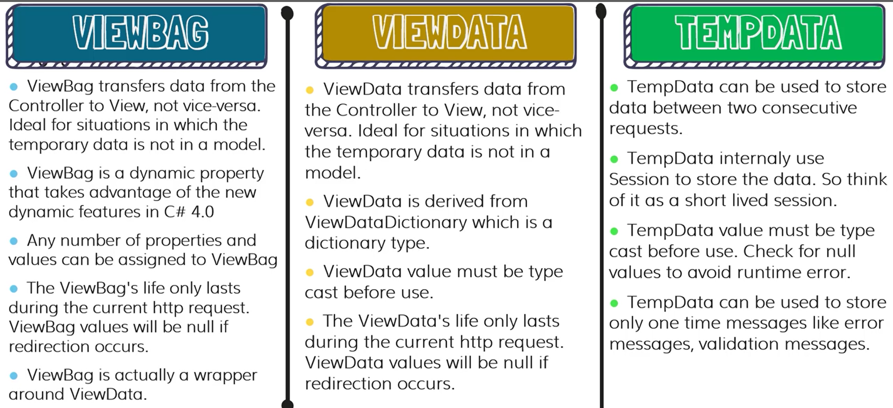

# E-commerce Application

Building a Book Store application.

## Functionality
- Build applications for shopping and management book store market using ASP.NET core apply MVC
model.
- Authentication and Authorization in ASP .NET Core.
- Google and Facebook Authentication/Login and Email notifications
- Stripe Payment Integrations
- Deploying website on Microsoft Azure
- Tech stack: C#.NET, Razor pages, HTML, CSS, JavaScript, Bootstrap, Stripe, Azure

## Progress and note

### 01. Get Started
### 02. Category CRUD Operations
### 03. Razor Project
### 04. N-Tier Architecture
### 05. Repository Pattern

### 06. Product CRUD
- Using DataAnotation from System.ComponentModel contributing to create Product model such as: Key, Required, DisplayName("Name"), Range(1,100, ErrorMessage = "Error Notification"), ValidateNever, ForeignKey(nameof(FieldName))
- Using ModelBuider in ApplicationDBContext to create Seed Data example: modelBuilder.Entity.HasData( new object())
- Convert a Category into IEnumerable of SelectListItem using Projection
- ViewBag transfer temporary data which does not have properties to store, from Controller to View. Using ViewBag.Key = Value in Controller, using ViewBag.Key to retrieve data in View Page
- ViewData similar to ViewBag except ViewData must be type cast before use, and Key of ViewData and ViewBag must not match. Syntax ViewData["Category"] = CategoryList; and Cast Type in View page before use
- TempData
- 
- ViewModel is a specific for a view. Using ViewModel to tranfer data from Controller to View
- File Upload Input in a form contain enctype="multipart/form-data", input contain type="file", using IFormFile for getting file in controller
- Using tinymce Editor 
- Using IWebHostEnvironment which is the builtin function in .NET to access root folder.
- Using Guid.NewGuid() to get random guid
    string fileName = Guid.NewGuid().ToString() + Path.GetExtension(file.FileName);
    string productPath = Path.Combine(wwwRoot, @"images\product");
    if(!string.IsNullOrEmpty(productVM.Product.ImageUrl))
    {
        var oldImagePath = Path.Combine(wwwRoot, productVM.Product.ImageUrl.TrimStart('\\'));
        if(System.IO.File.Exists(oldImagePath))
        {
                System.IO.File.Delete(oldImagePath);
        }
    }
    using (var fileStream = new FileStream(Path.Combine(productPath, fileName), FileMode.Create))
    {
        file.CopyTo(fileStream);
    }
    productVM.Product.ImageUrl = @"\images\product\" + fileName;
- Loading Navigation Properties using Include: db.Product.Include(u=>u.Category).Include(u=>u.Area);
- Using datatables.net plugin to search, pagination, view data table using ajax to custom column of table [HERE](https://github.com/danialtien/BookStore/commit/9fba4551adac1b2786c7c308ca4b5e4a281df311#diff-cbad95f37a7fe446afef055a47e10eda303e6c669bc39741fd8d091685baf1e7)
- Using sweetalert2.github.io for alert or confirmation popups

### 07. Home and Detail Page
...

### Contact me via tientung2029901@gmail.com or tiendoit20@gmail.com
#### Copyright &#169; 2023 danialtien

